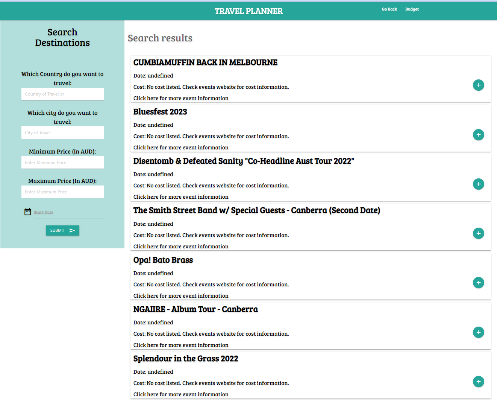

## PROJECT NO 1 - TRAVEL PLANNER

The project task here is to build a travel planner to plan the travellers' activities so that they don't overspend their budget.  Getting reliable information of the list of activities or events at a given destination will ease some of the headaches.  This will put the traveller (the user) at ease than suffer the activity or event not available at a location.  This application also presents the user both a way to find and store the information to plan their activities within their budget.

 

## PROJECT TEAM GROUP 4 CONTRIBUTORS

* Louie Ip
* Charlotte Dige
* Stella Ling
* Malcolm D'Souza
* Manroven Singh

## TECHNOLOGIES USED

* TicketMaster API
* Exchange Rate API
* HTML, CSS Materialise Framework, Moment.js
* JQuery
* The Fetch API

## PROCESS

 The below screenshots show the process the users would go through to see the list of activities at a destination and plan their budget. 

#### <em>Search Destinations</em> 
Enter the destination in the form input for country or city, price and start date and click Submit.
   

       
#### <em>List of Activities or Events</em> 
This bring on the list of activities or events in which the user can view the event information by clicking the link.

#### <em>Saved Activities</em>
The activities from the search results are saved in the budget list by the click of the button on the right hand side of the page and the user also have the ability to remove the activity by clicking on the button at the side.

The layout is also responsive and caters for mobile, tablets and desktop. 

## DEPLOYMENT

The application is deployed on GitHub and the repository name is Travel-planner.

The URL of the GitHub respository is :-

https://github.com/CharDige/Travel-planner.git

The URL of the functional, deployed application is :-

https://chardige.github.io/Travel-planner/

